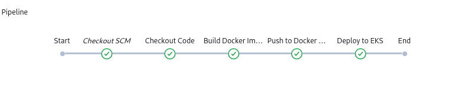

# 📚 Library Management System – Full DevOps Project

This is a **Library Management System** built with Flask and designed as a **complete DevOps project**. It demonstrates the practical use of **Terraform**, **Docker**, **Kubernetes**, **AWS**, **S3**, and **Jenkins** to build, test, deploy, and manage cloud-native applications using DevOps best practices.

---

## 🧰 Tech Stack

| Layer               | Tools Used                          |
|---------------------|-------------------------------------|
| **App Framework**   | Flask, SQLAlchemy, Jinja2           |
| **Database**        | SQLite (or PostgreSQL/MySQL)        |
| **Authentication**  | Flask-Login, Admin & User Roles     |
| **File Upload**     | AWS S3                              |
| **IaC**             | Terraform                           |
| **Containerization**| Docker                              |
| **CI/CD**           | Jenkins                             |
| **Orchestration**   | Kubernetes (AWS EKS)                |
| **Cloud Services**  | AWS EC2, EKS, S3                    |
| **Monitoring**      | Prometheus, Grafana                 |

---

## 🎯 Features

- User registration and login system
- Role-based access control (admin and normal user)
- Admins can:
  - Add, edit, or delete books and authors
  - View borrowed books by all users
- Users can:
  - View available books
  - Borrow and return books
  - See due dates and penalties
- Upload and store book images using **AWS S3**
- Borrowing penalties calculated on late returns

---

## 🔧 Infrastructure and Deployment Flow

### 1. Provisioning with Terraform
- AWS EC2 instance for Jenkins
- EKS cluster with node group
- IAM roles, VPC, and S3 bucket

### 2. CI/CD Pipeline via Jenkins
- Pull code from GitHub
- Build Docker image
- Push to DockerHub
- Deploy to Kubernetes

### 3. Containerization
- Flask app containerized using Docker
- Configuration via environment variables

### 4. Kubernetes Deployment
- Flask app deployed as pod in EKS
- NodePort or Ingress service
- Secrets for DB/mail credentials


## 📊 Monitoring with Prometheus and Grafana

Real-time metrics are collected using **Prometheus** and visualized via **Grafana dashboards**.

### 🔥 Grafana Dashboard


### 📈 Prometheus Metrics


---

## 📁 Project Structure

```
.
├── src/
│   ├── app.py
│   ├── templates/
│   ├── static/
│   │   └── uploads/books/
│   ├── Dockerfile
│   └── requirements.txt
│
├── terraform/
│   ├── main.tf
│   ├── eks.tf
│   └── s3.tf
├── k8s/
│   ├── deployment.yaml
│   ├── service.yaml
│   └── secret.yaml
├── jenkins/
│   └── Jenkinsfile
└── README.md
```

---

## 🚀 How to Deploy

### 🛠 Step 1: Infrastructure Provisioning with Terraform

```bash
cd terraform
terraform init
terraform apply
```

### 🐳 Step 2: Build & Push Docker Image

```bash
docker build -t yourdockerhub/library-app:latest .
docker push yourdockerhub/library-app:latest
```

### ☸️ Step 3: Deploy to Kubernetes

```bash
kubectl apply -f k8s/
```

### 🔁 Step 4: CI/CD via Jenkins

Your Jenkins pipeline will:
- Clone GitHub repo
- Build Docker image
- Push image to DockerHub
- Deploy to EKS using `kubectl`

---
### 📦 Monitoring Setup

- Deployed using Helm charts:
  ```bash
  helm repo add prometheus-community https://prometheus-community.github.io/helm-charts
  helm repo add grafana https://grafana.github.io/helm-charts
  helm install prometheus prometheus-community/kube-prometheus-stack

---

## ☁️ AWS Services Used

- **EKS** – Kubernetes Cluster
- **EC2** – Jenkins host
- **S3** – Upload storage for book images
- **IAM** – Role-based access
- **VPC** – Private cloud networking


---


## 📸 Screenshots

### 🔧 Jenkins CI/CD Pipeline


### 📚 Library Management UI


### 📊 Grafana Dashboard


### 📡 Prometheus Targets


